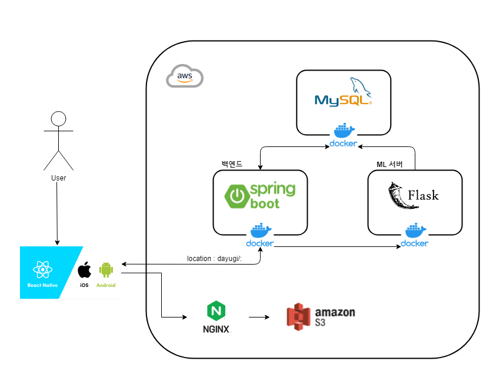
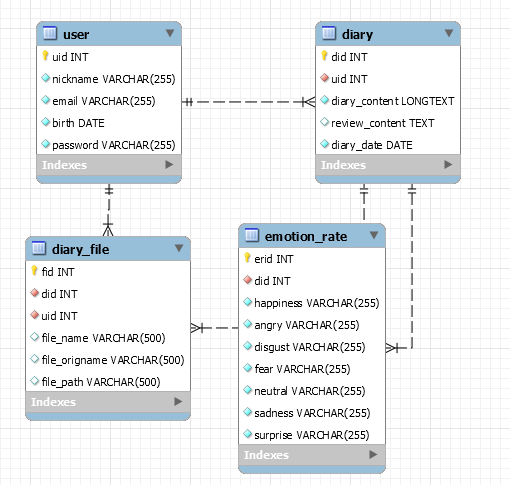
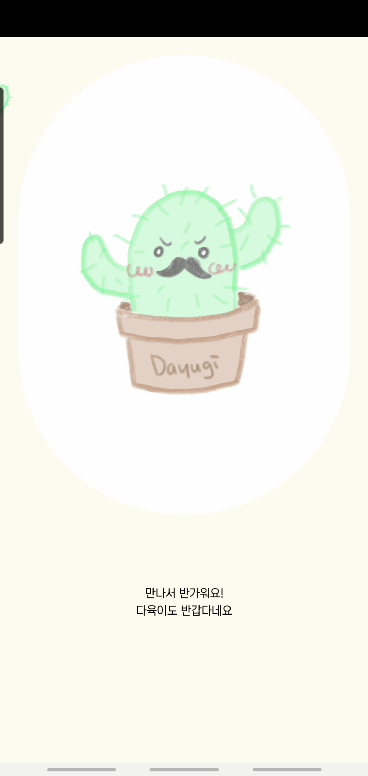
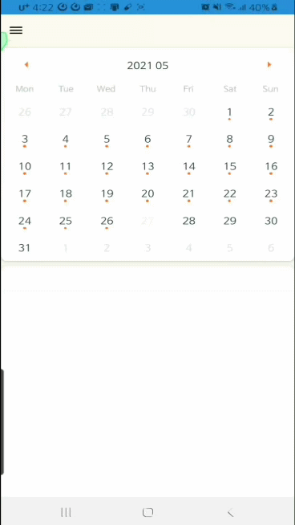
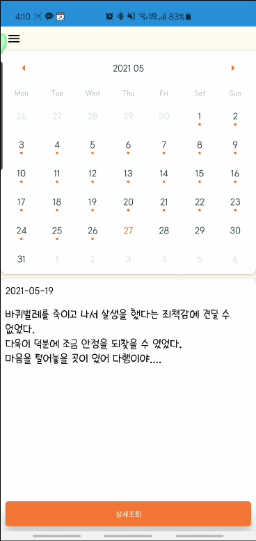
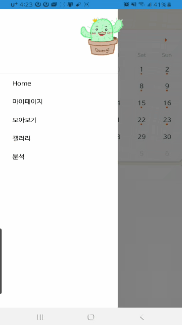
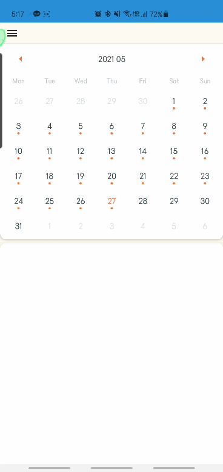

# 🌵Dayugi?

**머신러닝을 활용한 다이어리 분석과 감정 분석을 활용한 감성 다이어리 서비스**

- 머신러닝을 통해 구현한 모델이 한줄평을 통해서 위로의 한마디를 건내줍니다.
- 모델을 통해 작성한 다이어리에서 감정을 추출하여 선택한 기간의 감정변화를 그래프로 한눈에 확인할 수 있습니다.
- 다이어리에 올린 사진을 갤러리를 통해서 한눈에 볼 수 있습니다.

# Download and Setup

1. 이 저장소를 fork한 후 로컬 장치에 clone 하세요.

   `git clone https://lab.ssafy.com/s04-final/s04p31a206.git`

2. FE

   1. `yarn install`
   2. `npm start`
   3. CONNECTION LAN → Tunnel
   4. 접속
      1. 휴대폰 or 앱 플레이어에 Expo Go 앱 설치
      2. QR코드 스캔을 통한 접속

# 기술 스택

| 분류     | 사용 기술 스택                                               |
| -------- | ------------------------------------------------------------ |
| FE       |  |
| BE       |  |
| ML       |  |
| DevOps   |  |
| Database |  |
| etc      |  |

# About Us

| 이름   | 역할       |
| ------ | ---------- |
| 홍진표 | 팀장, ML   |
| 노태훈 | BE, FE     |
| 박영창 | FE         |
| 우희정 | BE, FE     |
| 이소영 | BE, DevOps |

# 시스템 아키텍쳐

# ERD

# 시연

### 튜토리얼

### 다이어리 작성

### 다이어리 조회 - Home

### 다이어리 조회 - 모아보기

### 마이페이지

### 분석페이지

