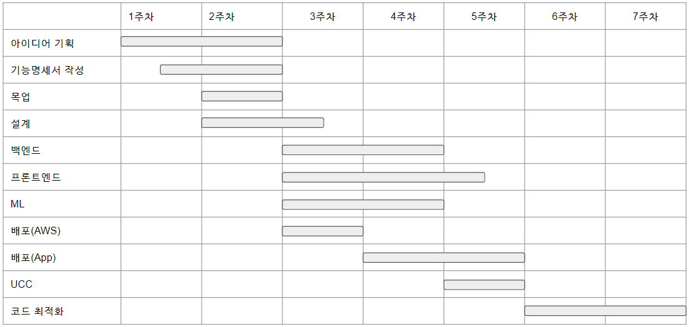

# 홍진표의 docs

- Vue.js, Django, Flask, Python, AWS, Tensorflow, Javascript, Mysql, Linux, Raspbian, Git

__21.04.22__

프로젝트 일정은 위와 같습니다.

오늘은 2주차 목요일이고 계획대로 되고있습니다.

다음주부터 본격적으로 개발에 착수할 예정입니다.

약 2주만에 개발이 마무리되어야하기 때문에 조금 타이트하게 계획을 세웠는데, 업무분담과 일에 집중할 수 있게 돕는 것이 중요할 것 같습니다.