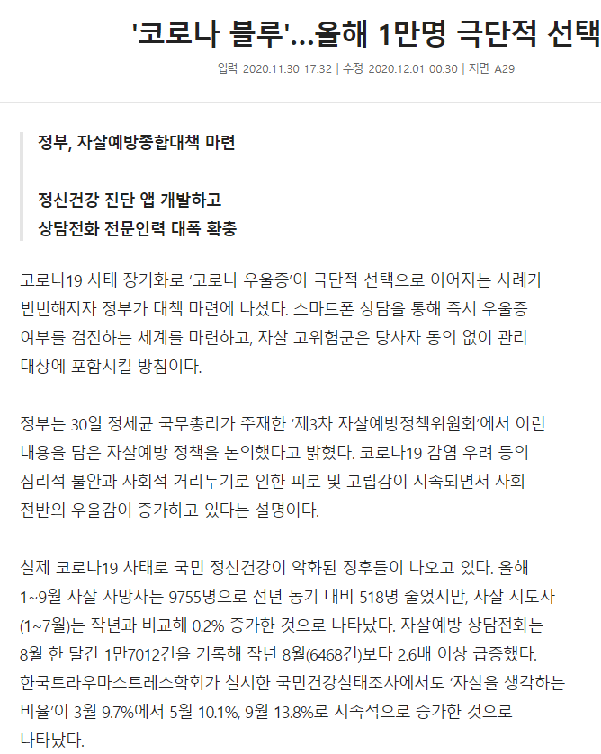
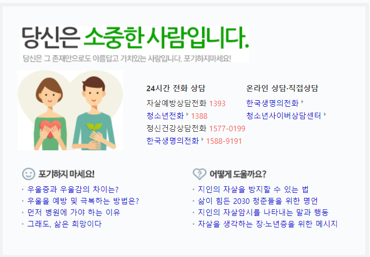
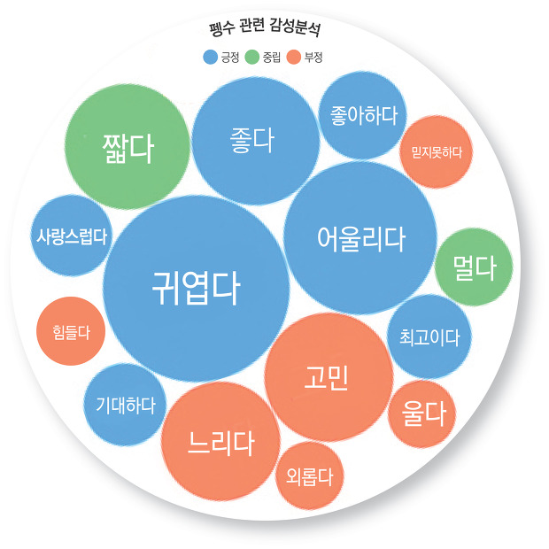
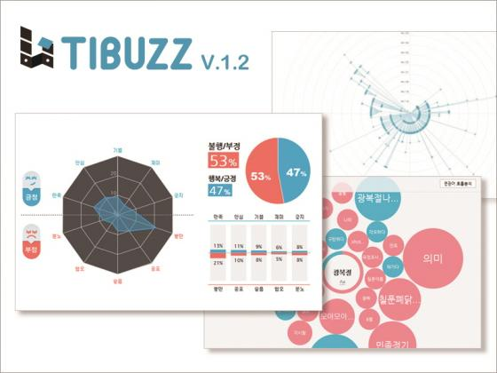

# 프로젝트 기획


__개발의도__

> 하이브리드 앱을 개발함으로서 앱 개발이라는 새로운 개발 영역에 도전한다!
>
> 또한, 쿠버네티스 도입등 평소 사용해보고 싶었던 기술과 영역을 프로젝트에서 적극적으로 적용하므로서 개인의 기술 스펙을 확장한다!





["숨진 청년들 PC엔 자소서 파일 가득"... 소리없이 느는 고독사](https://n.news.naver.com/mnews/article/020/0003352082?sid=102)


## 마음 일기장

- 한줄평: 텍스트 감정분석 해서 기분에 맞춰서 저장된 한줄평을 출력
- 기분을 분류, 기분에 따라서 텍스트를 저장해놔야할거 같음
- 나의 감정 분석해줌
- 캐릭터를 만들어서 매일 관리해주는 느낌으로 매일 일기장에 접속할 수 있도록 도움
- 사진, 동영상 추가 기능
- 정해진 시간에 일기 쓰라고 알람
- 검색 기능
- 달력 일정정리
- pc , 태블릿 연동: 메인 서비스는 앱이고 pc에서도 crud할 수 있다.
- 클라우드 연동

------

## 기술 스택

- 프론트:  Vue native(Vue.js)
- 백엔드: Spring
- 데이터베이스: MySQL
- DevOps: 도커, 쿠버네티스
- 감정분석, NLU: Tensorflow, Pytorch, flask
- 클라우드 연동: Google cloud API

https://medium.com/@hyunji.ma/sketch에서-figma로-삐빅-환승입니다-367f148987c5

------

## 전체 서비스

### 서비스 요소

**유저관리**

- 회원가입
  - 닉네임 ( 실명 X )
  - 나이 ( 입력받되 안넣어도된다 )
    - 나이가 없으면 default 상담
    - 청소년 나이이면 청소년 상담
    - 취준생이면 취준생 전용 상담
    - 
- 로그인 / 로그아웃

**다이어리**

- 다이어리 글쓰기
- 쓴 일기 확인
- 캘린더

**기타**

- 설정
  - 작성 시간 알람 맞추기
  - 원하는 한줄평 어투 정하기 (친구, 부모님, 선생님)
- 검색
- 다육이 관리

### 기능 요소

- 한줄평
  - (목표) 감정관련 데이터셋을 구해서 심리상담 모델을 구축
  - (차선책) 팀원과 함께 감정별로 한줄평 데이터를 구축

----

## 화면

- 메인페이지
  - 바로 달력
    - 달력 하단에
  - 왼쪽 상단에 메뉴 ...
  - 검색
- 리스트 보기 페이지
  - 다이어리글 보기
  - 검색
- 로딩페이지
  - 서비스 명 or 로고 or 애니메이션
- 마이페이지
  - 감정그래프 보기
  - 꼬박꼬박 다이어리글을 썼는지 보는
  - (이미지/동영상 모아보기? - 클릭하면 바로 다이어리글 보러갈 수 있도록?)
- 다육이 페이지
- 설정페이지
  - 다이어리의 색상을 지정할 수 있게 한다. (후순위)
- 잠금화면

---

## 일기 감정분석 & 상담

- 자살 가능성이 짙은 일기가 지속적으로 작성되면 상담사에게 연결할 수 있도록 지원 다육이 왈: xxx님 고민이 이렇군요 ㅠㅠ 김덕춘 상담사님(상담사 정보 링크 걸어두기)이 도움을 줄 수 있어요! 이 일기를 보여드려도 될까요? Y / N

**위로하는 3가지 원칙**

1. 상대의 감정을 읽어준다
2. 정상화, 상대의 감정 반응이 자연스럽고 당연하다는 것을 알려준다
   - 일기감정분석 후 : 여러분과 같은 고민을 하는 사람들이 이렇게 많답니다! (하고 알려줌)
3. 상대방의 진정한 가치를 승인해준다, 그럼에도 불구하고 너는 소중한 존재다

```java
ㅇㅇㅇ님 좋은 날이 돌아올거에요!

요즘 기분이 좋지 않아보여요..😥
(2. 자연스럽다는 반응의 멘트)
다른 사람과 고민을 나누어보면 한결 가벼워질 수 있어요.
ㅇㅇㅇ 상담사님과 고민을 나누어 보는 것은 어떨까요?!
```



[청소년 복지상담 센터 현황 | 데이터셋 상세 Open API | 경기데이터드림](https://data.gg.go.kr/portal/data/service/selectServicePage.do?page=1&rows=10&sortColumn=&sortDirection=&infId=WO5W4FV70B6GC3PPP15C12347715&infSeq=3)

- 회원가입할 때 익명(닉네임)으로 나이 입력

기분전환할만한걸 추천

내용분석 설정 on/off

bgm 깔기bgm 깔기

다육이 종류 3~4개, 눈 굴러다니면 귀엽겠다다육이 종류 3~4개, 눈 굴러다니면 귀엽겠다

## 데이터 시각화





### 참고 링크

- 감정 데이터셋

  - https://aihub.or.kr/node/11873
  - https://aihub.or.kr/node/274
  - https://aihub.or.kr/aidata/7978

- 상담센터 데이터셋

  - https://data.gg.go.kr/portal/data/service/selectServicePage.do?page=1&rows=10&sortColumn=&sortDirection=&infId=WO5W4FV70B6GC3PPP15C12347715&infSeq=3

- 상담 챗봇 코드

  - https://github.com/haven-jeon/KoGPT2-chatbot
  - https://rogerheederer.github.io/ChatBot_Wellness/

  